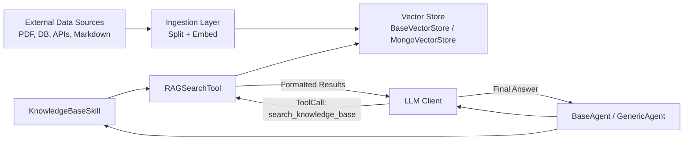
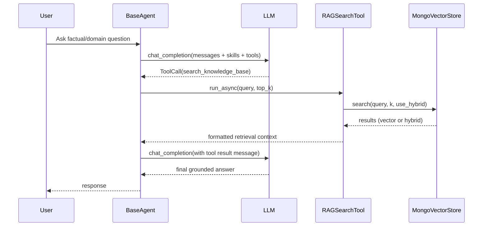

# Syndicate RAG Internals Guide

## Purpose

This document explains, in technical depth, how Syndicate approaches Retrieval-Augmented Generation (RAG), how the main internals work, and how these parts are interconnected at runtime.

Focus components:

- `RAGSearchTool`
- `KnowledgeBaseSkill`
- `BaseVectorStore` and `MongoVectorStore`
- Agent orchestration flow in `BaseAgent`

---

## 1. Syndicate's RAG Philosophy

Syndicate uses an **Agentic RAG** approach:

- Retrieval is exposed as an explicit tool call.
- The LLM decides when to retrieve.
- Context is pulled on-demand, not blindly injected every turn.

This differs from older "always-retrieve-then-stuff" designs. In Syndicate, retrieval is treated as a first-class capability alongside any other tool.

### Why this matters

- Lower prompt bloat and token waste
- Better traceability (tool calls are explicit)
- Better modularity (vector store can be reused by multiple agents)
- Cleaner separation between ingestion and serving time

---

## 2. High-Level Architecture



---

## 3. Layer Boundaries

Syndicate intentionally separates responsibilities:

1. **Ingestion (offline / prep path)**
- Text splitting
- Embedding generation
- Insertion into vector store

2. **Retrieval (online / runtime path)**
- Query embedding
- Search (vector / hybrid)
- Result formatting for model consumption

3. **Agent behavior layer**
- Skill prompt instructions
- Tool invocation loop
- Memory persistence and orchestration

This boundary is core to maintainability.

---

## 4. Ingestion Layer (Pre-Retrieval)

### 4.1 Text splitting

From `src/syndicate/ingestion/text_splitters.py`:

- `BaseTextSplitter`
- `CharacterTextSplitter`
- `RecursiveCharacterTextSplitter`

Typical flow:

1. Load documents externally
2. Split with overlap
3. Send chunks to vector store

### 4.2 Embedding models

From `src/syndicate/ingestion/embedding_models.py`:

- `EmbeddingModel` (abstract)
- `SentenceTransformerEmbedding`
- `OpenAIEmbedding`
- `GeminiEmbedding`
- `CohereEmbedding` (exported via `ingestion/__init__.py`)

Important details:

- `embed(text)` and `embed_batch(texts)` are async APIs.
- Local sentence-transformers path uses `run_in_executor` to avoid blocking the event loop.

---

## 5. Vector Store Contracts and Implementation

## 5.1 Base contract (`BaseVectorStore`)

From `src/syndicate/vectorstores/base.py`, every vector store must implement:

- `search(query, k=4, filter=None, use_hybrid=True)`
- `add_texts(texts, metadatas=None, ids=None)`
- `delete(ids=None)`
- `get_by_ids(ids)`

Also provides:

- input validation (`_validate_inputs`)
- ID generation (`_generate_ids`)
- convenience clear (`clear`)
- utility ranking merge (`reciprocal_rank_fusion`)

### Return contract

Search returns native dictionaries, not wrapper classes, typically:

```python
{
  "id": "doc-id",
  "text": "chunk text",
  "metadata": {...},
  "score": 0.95,
}
```

---

## 5.2 Mongo implementation (`MongoVectorStore`)

From `src/syndicate/vectorstores/mongo.py`.

### Requirements

- Atlas-only features:
  - `$vectorSearch`
  - `$search`
- Requires both index types for full hybrid behavior:
  - vector index (embedding)
  - search index (text)

### Search modes

#### Vector search (`_vector_search`)

- Uses query embedding + `$vectorSearch`
- Adds optional metadata pre-filter
- Projects result fields and vector score

#### Keyword search (`_keyword_search`)

- Uses Atlas `$search` with text query
- Adds optional filter
- Uses search score
- Handles `OperationFailure` by returning `[]`

#### Hybrid search (`_hybrid_search`)

- Runs vector and keyword searches in parallel (`asyncio.gather`)
- Merges using Reciprocal Rank Fusion (RRF)
- Returns top-k merged results
- Fallback behavior:
  - if keyword fails/empty: return vector results
  - if vector empty: return keyword results

### Insertion path (`add_texts`)

- validates input lengths/IDs
- auto-generates IDs if omitted
- computes embeddings via `embedding_model.embed_batch`
- inserts docs with `_id`, `text`, `embedding`, `metadata`

### Result normalization (`_format_results`)

- normalizes IDs to string
- ensures metadata is always dict (empty fallback)
- preserves `score` and/or `rrf_score` if present

---

## 6. RAG Tool Internals (`RAGSearchTool`)

From `src/syndicate/tools/rag_tool.py`.

## 6.1 Purpose

`RAGSearchTool` is the runtime bridge between:

- **Agent tool-calling loop** and
- **Vector store retrieval API**.

## 6.2 Input schema

`RAGSearchArgs`:

- `query: str`
- `top_k: int` constrained to 1..10

## 6.3 Execution behavior

- `run()` is intentionally disabled (`NotImplementedError`)
- `run_async()` validates args and calls `_execute`

`_execute`:

1. Chooses k (request override or tool default)
2. clamps k to [1, 10]
3. calls `vector_store.search(query, k, use_hybrid=...)`
4. formats user/LLM-readable blocks with source/page/score
5. returns structured payload:

```python
{
  "success": bool,
  "results": [...],
  "count": int,
  "formatted": str,
}
```

On exceptions it returns `success=False` plus a formatted error string.

### Output style rationale

The tool returns a human-readable string (`formatted`) optimized for model consumption, but still keeps raw result payloads available internally in `_execute` return.

---

## 7. KnowledgeBaseSkill Internals

From `src/syndicate/skills/rag_skill.py`.

`KnowledgeBaseSkill` subclasses `SkillModule` and bundles:

1. Prompt expertise
2. Capabilities glossary metadata
3. A preconfigured `RAGSearchTool`

## 7.1 Construction behavior

At init time it:

1. Creates a `RAGSearchTool` with passed vector store config
2. Builds expertise text (default or custom)
3. Adds optional `additional_instructions`
4. Calls `SkillModule` constructor with:
   - `name="knowledge_base"`
   - dynamic `description`
   - `tools=[search_tool]`
   - `priority=10`

## 7.2 Customization API (current)

`KnowledgeBaseSkill` now supports prompt customization without subclassing:

- `instructions_template: Optional[str]`
- `instructions_mode: Literal["replace", "append"]`
- `expertise_builder: Optional[Callable[[str], str]]`

Validation rules:

- mode must be `replace` or `append`
- template and builder are mutually exclusive
- invalid template placeholders raise a clear `ValueError`

Template supports `{domain}` placeholder only.

### Practical impact

This enables localization/domain tuning (for example Spanish legal guidance) without rebuilding a custom skill class unless deeper behavior changes are needed.

---

## 8. How Skills Become Runtime Behavior

This connection happens in `src/syndicate/agents/base.py`.

## 8.1 Prompt injection

- `_build_system_prompt_with_skills()` sorts skills by priority
- appends each skill section via `skill.to_prompt_section()`

## 8.2 Tool integration

- `_integrate_skill_tools()` and `install_skill()` collect each skill's tools
- tool instances are materialized and provider-formatted via `to_format(...)`

## 8.3 Request snapshot safety

Before invoking model calls, BaseAgent snapshots:

- system prompt
- formatted tools
- tool map

This avoids cross-request contamination in concurrent environments.

---

## 9. Runtime Orchestration (Invoke and Stream)

## 9.1 Blocking invoke flow (`_orchestrate_invoke`)

Loop until max iterations:

1. call LLM with current messages + system prompt + tools
2. if no tool calls: return final content
3. if tool calls:
   - guardrail check (`max_total_tool_calls`)
   - execute tools concurrently
   - append tool messages
   - continue loop

## 9.2 Streaming flow (`_orchestrate_stream`)

Similar loop with stream chunks:

- forwards content/thinking/tool events incrementally
- emits start/success/error events around tool calls
- appends tool messages and continues loop as needed

---

## 10. Message and Tool Contracts That Glue Everything Together

From `src/syndicate/communication_models.py`.

Core classes:

- `ToolCall`
- `Message`
- `ToolResultEnvelope`

### Important invariants

- `Message(role="tool")` must include `tool_call_id`
- `ToolResultEnvelope` normalizes every tool result into:
  - `status`: success/error
  - `result`
  - `error`
  - `metadata`

This normalized envelope is serialized and stored as tool-message content, making invoke and stream paths consistent.

---

## 11. Memory Persistence and RAG Reproducibility

From `_store_interaction` in `BaseAgent`:

- rollover check happens once before writing a message batch
- batch write uses `defer_rollover=True`

Reason: keep interaction atomic and avoid splitting AI tool-call and tool-response pairs across different buckets, which can break provider expectations in later turns.

---

## 12. End-to-End Sequence (Typical Query)



---

## 13. Interconnection Summary

`KnowledgeBaseSkill` wires model behavior + retrieval tool.

`RAGSearchTool` wires tool API + vector search execution.

`BaseVectorStore` defines retrieval contract.

`MongoVectorStore` provides concrete retrieval mechanics (vector, keyword, hybrid).

`BaseAgent` orchestrates the loop that repeatedly alternates between model reasoning and tool execution until a final answer is produced.

---

## 14. Extension Patterns

### Pattern A: Fast customization (recommended first)

Use `KnowledgeBaseSkill` with:

- `domain`
- `additional_instructions`
- `instructions_template` / `expertise_builder`

### Pattern B: Domain-specific retrieval tool wrapper

Subclass `RAGSearchTool` when you need query enrichment, metadata policy filters, or custom result formatting.

### Pattern C: Ground-up custom tool + custom skill

Use only when requirements diverge heavily (compliance workflows, deterministic legal pipelines, multi-source precedence logic, strict audit schemas).

---

## 15. Known Notes from Current Codebase

1. `MongoVectorStore` is Atlas-specific by design due to `$vectorSearch` / `$search` usage.
2. Tests cover:
   - vector store hybrid behavior and fallbacks
   - skill customization options and validations
3. In current package exports, `RAGSearchTool` is defined in `src/syndicate/tools/rag_tool.py`. Depending on import path expectations, check `src/syndicate/tools/__init__.py` re-exports in your branch.

---

## 16. Suggested Reading Map (Code)

- `src/syndicate/tools/rag_tool.py`
- `src/syndicate/skills/rag_skill.py`
- `src/syndicate/vectorstores/base.py`
- `src/syndicate/vectorstores/mongo.py`
- `src/syndicate/agents/base.py`
- `src/syndicate/communication_models.py`
- `src/syndicate/ingestion/embedding_models.py`
- `src/syndicate/ingestion/text_splitters.py`
- `examples/rag_knowledge_base_example.py`
- `tests/test_regressions.py`

---

## 17. Practical Build Checklist

1. Choose embedding model and splitter.
2. Ingest document chunks into vector store.
3. Build `KnowledgeBaseSkill` with domain-specific instructions.
4. Install skill on agent.
5. Validate hybrid search and citations behavior with representative queries.
6. Add regression tests for your domain-specific constraints.

---

Last updated: 2026-04-24
