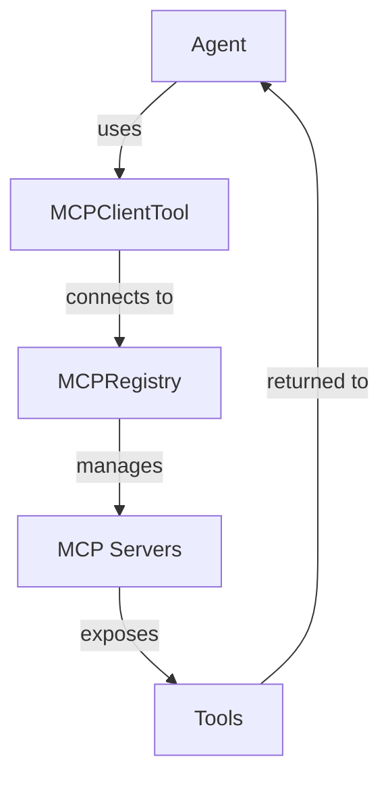
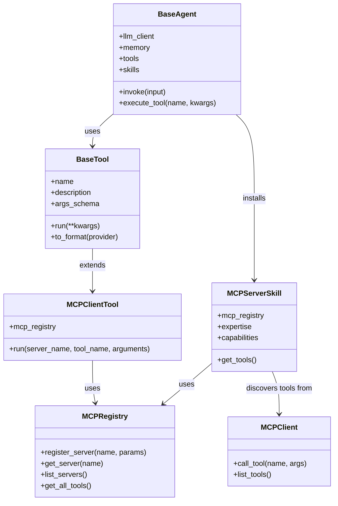

# MCP Integration - Hybrid Approach Plan

## Overview

A three-layer architecture for MCP server integration:
1. **MCPRegistry** - Central management of MCP connections
2. **MCPClientTool** - Generic tool that connects to any registered server
3. **MCPServerSkill** - Optional skill wrapper for domain-specific MCP servers



---

## 1. MCPTool Configuration

### File: `tools/mcp_tool.py`

```python
from typing import Dict, Any, Optional, List
from pydantic import BaseModel, Field
from .base_tool import BaseTool

class MCPClientArgs(BaseModel):
    """Arguments for MCP client tool."""
    server_name: str = Field(..., description="Name of the registered MCP server")
    tool_name: str = Field(..., description="Name of the tool to execute")
    arguments: Dict[str, Any] = Field(default_factory=dict, description="Tool arguments")

class MCPClientTool(BaseTool):
    """
    Generic MCP client tool that connects to registered MCP servers.
    
    Enables agents to:
    - Connect to any registered MCP server
    - Execute tools exposed by those servers
    - Get results back in a standardized format
    """
    name = "mcp_client"
    description = "Connect to an MCP server and execute its tools. Use server_name to specify which server, and tool_name to specify which tool to call."
    args_schema = MCPClientArgs
    
    def __init__(self, mcp_registry: "MCPRegistry"):
        """
        Initialize the MCP client tool.
        
        Args:
            mcp_registry: The MCP registry instance to use for server connections
        """
        self.mcp_registry = mcp_registry
        super().__init__()
    
    def run(self, **kwargs) -> str:
        """
        Execute an MCP tool through the registry.
        
        Args:
            **kwargs: Arguments matching MCPClientArgs
                - server_name: Name of the registered MCP server
                - tool_name: Name of the tool to execute
                - arguments: Tool arguments
                
        Returns:
            JSON string with tool execution result
        """
        args = self.args_schema(**kwargs)
        
        # Get the MCP client from registry
        mcp_client = self.mcp_registry.get_server(args.server_name)
        if not mcp_client:
            return {
                "success": False,
                "error": f"MCP server '{args.server_name}' not found. Available servers: {self.mcp_registry.list_servers()}"
            }
        
        # Execute the tool through the MCP client
        result = mcp_client.call_tool(args.tool_name, args.arguments)
        
        return result
```

---

## 2. Registering an MCP Server Connection

### File: `registry.py` (Extended)

```python
from typing import Dict, Optional, List, TYPE_CHECKING
from weakref import WeakValueDictionary
from mcp import ClientSession, StdioServerParameters

if TYPE_CHECKING:
    from agents.base import BaseAgent
    from tools.base_tool import BaseTool
    from tools.mcp_tool import MCPClientTool

class MCPRegistry:
    """
    Central registry for MCP server connections.
    
    Manages:
    - Server registration and lifecycle
    - Connection pooling
    - Tool discovery
    """
    
    _servers: Dict[str, "MCPClient"] = {}
    _server_params: Dict[str, StdioServerParameters] = {}
    
    @classmethod
    def register_server(
        cls,
        name: str,
        server_params: StdioServerParameters,
        auto_discover_tools: bool = True
    ) -> None:
        """
        Register an MCP server for use by agents.
        
        Args:
            name: Unique name for the server (e.g., "filesystem", "postgres")
            server_params: StdioServerParameters for connecting to the server
            auto_discover_tools: Whether to automatically discover and register tools
        """
        cls._server_params[name] = server_params
        cls._servers[name] = None  # Initialize as None (lazy connection)
    
    @classmethod
    def get_server(cls, name: str) -> Optional["MCPClient"]:
        """
        Get or create an MCP client for the server.
        
        Args:
            name: Server name
            
        Returns:
            MCPClient instance or None
        """
        if name not in cls._servers:
            return None
        
        # Lazy initialization - create connection on first use
        if cls._servers[name] is None:
            server_params = cls._server_params.get(name)
            if not server_params:
                return None
            
            # Create new MCP client
            from mcp import ClientSession, StdioServerParameters
            from mcp.client.stdio import stdio_client
            
            async def _create_client():
                async with stdio_client(server_params) as (read, write):
                    async with ClientSession(read, write) as session:
                        await session.initialize()
                        return session
            
            # For now, return None - actual async implementation would need async agent support
            # This is a placeholder for the async pattern
            cls._servers[name] = None
        
        return cls._servers[name]
    
    @classmethod
    def list_servers(cls) -> List[str]:
        """Get list of all registered server names."""
        return list(cls._server_params.keys())
    
    @classmethod
    def unregister_server(cls, name: str) -> bool:
        """Remove a server from the registry."""
        if name in cls._server_params:
            del cls._server_params[name]
            if name in cls._servers:
                del cls._servers[name]
            return True
        return False
    
    @classmethod
    def get_all_tools(cls) -> Dict[str, List[str]]:
        """
        Get all tools available across all registered servers.
        
        Returns:
            Dict mapping server names to lists of tool names
        """
        tools = {}
        for server_name in cls.list_servers():
            client = cls.get_server(server_name)
            if client:
                tools[server_name] = client.list_tools()
            else:
                tools[server_name] = []
        return tools
```

### Configuration Example: `.env`

```env
# MCP Server Configuration
MCP_SERVERS=filesystem,postgres,github

# Filesystem MCP Server
MCP_FILESYSTEM_COMMAND=npx
MCP_FILESYSTEM_ARGS=-y @modelcontextprotocol/server-filesystem /path/to/files

# PostgreSQL MCP Server
MCP_POSTGRES_HOST=localhost
MCP_POSTGRES_PORT=5432
MCP_POSTGRES_USER=agent
MCP_POSTGRES_PASSWORD=secret
MCP_POSTGRES_DATABASE=agent_db

# GitHub MCP Server
MCP_GITHUB_TOKEN=ghp_xxxxxxxxxxxx
MCP_GITHUB_REPO=owner/repo
```

### Configuration Example: `main.py`

```python
from dotenv import load_dotenv
from registry import MCPRegistry
from mcp import StdioServerParameters

load_dotenv()

# Register MCP servers
MCPRegistry.register_server(
    name="filesystem",
    server_params=StdioServerParameters(
        command="npx",
        args=["-y", "@modelcontextprotocol/server-filesystem", "/workspace"]
    )
)

MCPRegistry.register_server(
    name="postgres",
    server_params=StdioServerParameters(
        command="npx",
        args=["-y", "@modelcontextprotocol/server-postgres"],
        env={
            "POSTGRES_HOST": os.getenv("MCP_POSTGRES_HOST"),
            "POSTGRES_PORT": os.getenv("MCP_POSTGRES_PORT"),
            "POSTGRES_USER": os.getenv("MCP_POSTGRES_USER"),
            "POSTGRES_PASSWORD": os.getenv("MCP_POSTGRES_PASSWORD"),
            "POSTGRES_DATABASE": os.getenv("MCP_POSTGRES_DATABASE"),
        }
    )
)
```

---

## 3. Agent Interaction

### Example: Creating an Agent with MCP Tools

```python
from agents.base import BaseAgent
from tools.mcp_tool import MCPClientTool
from registry import MCPRegistry

# Create MCP client tool with registry
mcp_tool = MCPClientTool(mcp_registry=MCPRegistry)

# Create agent with MCP tool
agent = BaseAgent(
    llm_client=client,
    memory=memory,
    system_prompt="You are a helpful assistant with access to filesystem and database tools.",
    tools=[mcp_tool]
)

# Agent can now use MCP tools
response = agent.invoke("Read the file README.md from the filesystem server")
# Internally calls: mcp_client.run(server_name="filesystem", tool_name="read_file", arguments={"path": "README.md"})
```

### Example: Agent Using Multiple MCP Servers

```python
# Agent with access to multiple MCP servers
agent = BaseAgent(
    llm_client=client,
    memory=memory,
    system_prompt="""
    You are a data analyst with access to:
    - filesystem: For reading and writing files
    - postgres: For querying databases
    
    Use the mcp_client tool to interact with these servers.
    """,
    tools=[mcp_tool]
)

# Agent can orchestrate across servers
response = agent.invoke("""
    Read the data.csv file from filesystem, then query the database 
    to find the average value in the 'value' column.
""")
```

### Example: Using MCPServerSkill for Domain Expertise

```python
from skills.skill_module import SkillModule

class FilesystemSkill(SkillModule):
    """Skill for filesystem operations."""
    
    def __init__(self, mcp_registry: MCPRegistry):
        self.mcp_registry = mcp_registry
        self.name = "Filesystem Expert"
        self.description = "Expertise in file system operations"
        self.expertise = """
        You are a filesystem expert. You can:
        - Read, write, and manipulate files
        - List directory contents
        - Search for files
        - Handle file permissions
        
        Use the mcp_client tool with server_name='filesystem' to perform operations.
        """
        self.capabilities = ["Read files", "Write files", "List directories", "Search files"]
        self.glossary = {
            "Path": "File or directory location",
            "Permission": "Access rights for files/directories"
        }
        self.mcp_servers = ["filesystem"]
    
    def get_tools(self):
        """Get tools from the filesystem server."""
        client = self.mcp_registry.get_server("filesystem")
        if client:
            return client.list_tools()
        return []

# Install skill on agent
agent.install_skill(FilesystemSkill(mcp_registry=MCPRegistry))
```

---

## Architecture Diagram



---

## Implementation Steps

1. **Create `registry.py` extensions** - Add MCPRegistry class
2. **Create `tools/mcp_tool.py`** - Implement MCPClientTool
3. **Create `skills/mcp_skill.py`** - Implement MCPServerSkill
4. **Update `main.py`** - Register MCP servers on startup
5. **Add async support** - For actual MCP client connections
6. **Create examples** - Demonstrate usage patterns

---

## Key Design Decisions

| Decision | Rationale |
|----------|-----------|
| Lazy connection | Servers only connect when first used |
| Central registry | Single source of truth for server management |
| Generic tool | Works with any MCP server, no custom code needed |
| Skill wrapper | Optional domain expertise for specific servers |
| Async-first | MCP protocol is async, aligns with modern Python |
